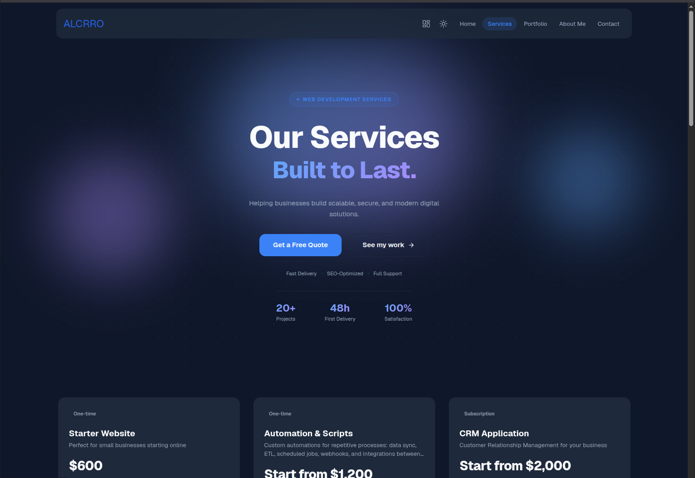

# ServicesDev — B2B Web Services Platform

Full-stack platform for managing web service orders end-to-end: from public service discovery and client inquiries through order tracking, task management, AI-assisted discussions, and invoicing.

**Live:** [web-services-test.vercel.app](https://web-services-test.vercel.app)



---

## Tech Stack

| Layer | Technologies |
|---|---|
| **Frontend** | Next.js 16, React 19, TypeScript, Tailwind CSS v4, Sass |
| **State** | TanStack Query v5, Zustand |
| **Backend** | Next.js API Routes, Zod v4, JWT, bcrypt |
| **Database** | PostgreSQL, Prisma ORM |
| **UI** | Radix UI, Lucide React, Tiptap, ECharts, TanStack Table |
| **Integrations** | Anthropic SDK, Octokit (GitHub), next-themes |
| **Infra** | AWS Amplify, Vitest |

---

## Features

| Feature | Status |
|---|---|
| Auth (Login / Sign-up) | ✅ Done |
| Public — About | ✅ Done |
| Public — Contact | ✅ Done |
| Public — Portfolio | ✅ Done |
| Services (Listing) | ✅ Done |
| Service Detail Page | ✅ Done |
| Service Inquiries | ✅ Done |
| Admin Panel | ✅ Done |
| Order Discussions | ✅ Done |
| Client Dashboard | ✅ Done |
| Public — Home | 🔄 In Progress |
| Orders | 🔄 In Progress |
| Client Workspace (My Projects) | 🔄 In Progress |
| Tasks | 🔄 In Progress |
| Notifications | 🔄 In Progress |
| Invoices | ⬜ Not Started |
| Payments | ⬜ Not Started |
| GitHub Integration | ⬜ Not Started |

---

## Architecture

```
src/
├── app/
│   ├── (pages)/          # Public marketing pages
│   ├── (auth)/           # Login / sign-up
│   ├── (client)/         # Protected client dashboard
│   └── (administrator)/  # Protected admin area
│
├── modules/              # Domain-driven modules
│   └── [domain]/
│       ├── domain/       # Interfaces & types
│       ├── infrastructure/  # Repositories, mappers, API clients
│       ├── application/  # Use cases (*.usecase.ts)
│       └── components/   # Domain-specific React components
│
├── shared/               # Atoms → Molecules → Organisms → Templates
├── lib/                  # Prisma client, axios interceptor, SEO utils
├── context/ & store/     # Zustand stores
└── infrastructure/api/   # BaseAPI + client-side API classes
```

**Auth:** JWT access token (15m) + refresh token (7d) in httpOnly cookies. Refresh logic in `src/proxy.ts`.

**Database:** Soft deletes on all core entities (`isDeleted` + `deletedAt`). `totalPrice` always computed server-side.

**CSP:** Nonce-based Content Security Policy generated per request.

---

## Getting Started

### Prerequisites

- Node.js 20+
- PostgreSQL database

### Install

```bash
npm install
```

Prisma client is auto-generated via `postinstall`.

### Environment

Create `.env.local`:

```env
DATABASE_URL=postgresql://...
JWT_SECRET=
JWT_ACCESS_EXPIRY=15m
JWT_REFRESH_EXPIRY=7d
NEXT_PUBLIC_API=http://localhost:3000
GITHUB_TOKEN=
GITHUB_OWNER=
GITHUB_REPO=
```

### Database

```bash
npx prisma migrate dev
```

### Run

```bash
npm run dev       # dev server → http://localhost:3000
npm run build     # production build
npm run check     # lint + type-check
npm run test      # vitest
```
